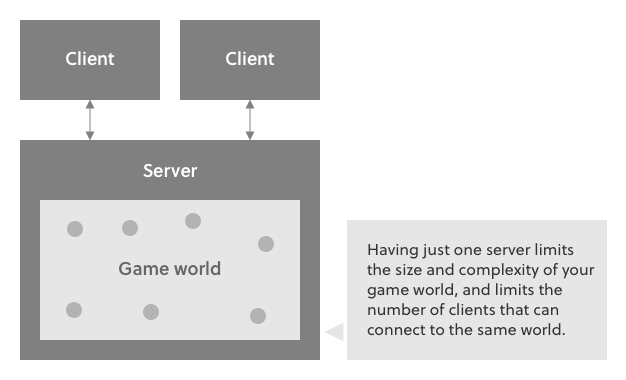
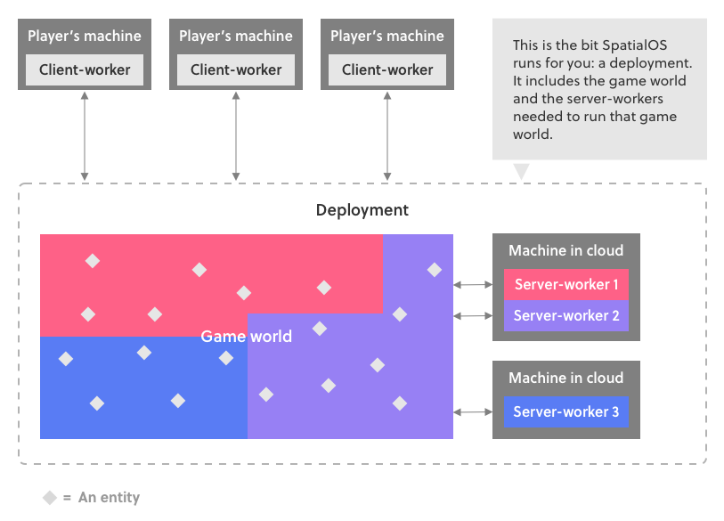

# Horizon Expanse

## What is it?
Expanse is a project which aims to completely replace minecraft's networking internals with SpatialOS to allow infinite worlds with near infinite people.

## How does it work?

The traditional ways to develop large online games mean that you’re either limited by the capacity of a single game server, or you have to shard your game world.

SpatialOS works differently: it brings together many servers so they’re working as one. But it does this in a way that makes a single world which looks seamless to players.

[Images from SpatialOS documentation](https://docs.improbable.io/reference/14.0/shared/concepts/spatialos)

## How can I contribute? 

### Prerequisites

- [Java 8](http://www.oracle.com/technetwork/java/javase/downloads/jdk8-downloads-2133151.html)
- SpatialOS [Windows](https://docs.improbable.io/reference/14.0/shared/setup/win) [MacOS](https://docs.improbable.io/reference/14.0/shared/setup/mac) [Linux](https://docs.improbable.io/reference/14.0/shared/setup/linux)

### Hardware Requirements
|           | Minimum                           | Recommended                              |
|-----------|-----------------------------------|------------------------------------------|
| Memory    | 8GB                               | 16GB                                     |
| Network   | Any broadband internet connection | High-speed broadband internet connection |
| Storage   | 12GB available space              | 12GB available space                     |

### Setting up the workspace

Coming Soon